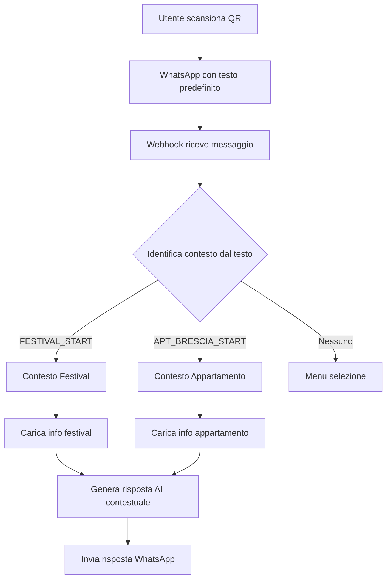

# 🔄 Architettura Multi-Contesto per ConnyUp Bot

## 📋 Panoramica

Il sistema evolve da un bot mono-contesto (Festival) a un sistema multi-contesto che può gestire:
- Festival ConnyUp
- Appartamenti turistici (Brescia e altri)
- Altri business futuri

## 🎯 Strategie di Identificazione Contesto

### Opzione 1: Deep Link WhatsApp (CONSIGLIATA)
```
QR Festival → wa.me/34644409180?text=FESTIVAL_START
QR Appartamento → wa.me/34644409180?text=APT_BRESCIA_START
```

**Vantaggi:**
- Facile da implementare
- Nessuna modifica infrastruttura
- Utente non vede il codice

### Opzione 2: Parametri URL personalizzati
```
QR Festival → wa.me/34644409180?context=festival
QR Appartamento → wa.me/34644409180?context=apt_brescia
```

**Note:** WhatsApp non passa parametri custom, quindi questa opzione non funziona direttamente.

### Opzione 3: Database QR Codes
- Generare codici univoci per ogni contesto
- Mappare codici a contesti nel database

## 🏗️ Nuova Struttura Database

### Collections esistenti:
- `conversations` - Aggiungere campo `context`
- `festival_info` - Resta invariata

### Nuove collections:
```javascript
// Configurazione contesti
contexts: {
  _id: ObjectId,
  code: "apt_brescia",
  name: "Appartamento Smeraldo Brescia",
  type: "apartment",
  welcome_message: "Benvenuto all'Appartamento Smeraldo!",
  system_prompt: "Sei un assistente virtuale per ospiti...",
  active: true,
  created_at: Date
}

// Informazioni appartamenti
apartment_info: {
  _id: ObjectId,
  context_code: "apt_brescia",
  category: "check_in",
  content: "Il check-in è dalle 15:00...",
  priority: 1,
  created_at: Date
}

// Servizi locali
local_services: {
  _id: ObjectId,
  context_code: "apt_brescia",
  type: "restaurant",
  name: "Osteria del Borgo",
  description: "Cucina tradizionale bresciana",
  distance: "5 min a piedi",
  google_maps_url: "https://...",
  rating: 4.5
}

// Istruzioni smart home
smart_home_instructions: {
  _id: ObjectId,
  context_code: "apt_brescia",
  device: "ttlock",
  instructions: "Per aprire la porta con TTLock...",
  troubleshooting: ["Se non funziona, prova...", "..."]
}
```

## 🔄 Flusso di Conversazione Multi-Contesto



## 🛠️ Modifiche al Codice

### 1. Aggiornamento models.py
- Aggiungere campo `context` a Conversation
- Creare nuovi modelli per Context, ApartmentInfo, etc.

### 2. Aggiornamento app.py
- Modificare `handle_text_message` per riconoscere contesto
- Aggiornare `get_festival_context` → `get_context_info`
- Implementare router per diversi contesti

### 3. Nuovo modulo context_manager.py
- Gestione centralizzata dei contesti
- Caricamento informazioni specifiche
- Template risposte per contesto

### 4. Aggiornamento admin_panel.py
- Interface per gestire multipli contesti
- CRUD per ogni tipo di informazione
- Switch contesto nell'admin

## 🎨 Esempi di Conversazione

### Festival:
```
Bot: Benvenuto al ConnyUp Festival! Come posso aiutarti?
User: A che ora suona il gruppo X?
Bot: Il gruppo X suonerà alle 21:00 sul palco principale...
```

### Appartamento:
```
Bot: Benvenuto all'Appartamento Smeraldo! Sono qui per rendere il tuo soggiorno perfetto.
User: Come faccio il check-in?
Bot: Il check-in è self-service! Ti ho inviato un codice per TTLock...
User: Quali ristoranti consigli?
Bot: Ecco i migliori ristoranti nelle vicinanze...
```

## 🚀 Fasi di Implementazione

### Fase 1: Infrastruttura Multi-Contesto
1. Aggiornare modelli database
2. Implementare context manager
3. Modificare routing messaggi

### Fase 2: Contesto Appartamento
1. Creare database info appartamento
2. Configurare risposte check-in
3. Integrare info locali

### Fase 3: Admin Panel Multi-Contesto
1. Aggiungere selezione contesto
2. Interfacce specifiche per tipo
3. Gestione QR codes

### Fase 4: Testing e Ottimizzazione
1. Test con diversi QR
2. Ottimizzare cambio contesto
3. Analytics per contesto

## 🔐 Considerazioni di Sicurezza

- Validare sempre il contesto ricevuto
- Limitare accesso info per contesto
- Log separati per ogni contesto
- Permessi admin per contesto

## 📊 Vantaggi dell'Approccio

1. **Scalabilità**: Facile aggiungere nuovi contesti
2. **Manutenibilità**: Codice modulare e organizzato
3. **Flessibilità**: Ogni contesto può avere logiche diverse
4. **Analytics**: Metriche separate per business
5. **Costi**: Un solo numero WhatsApp per N business 